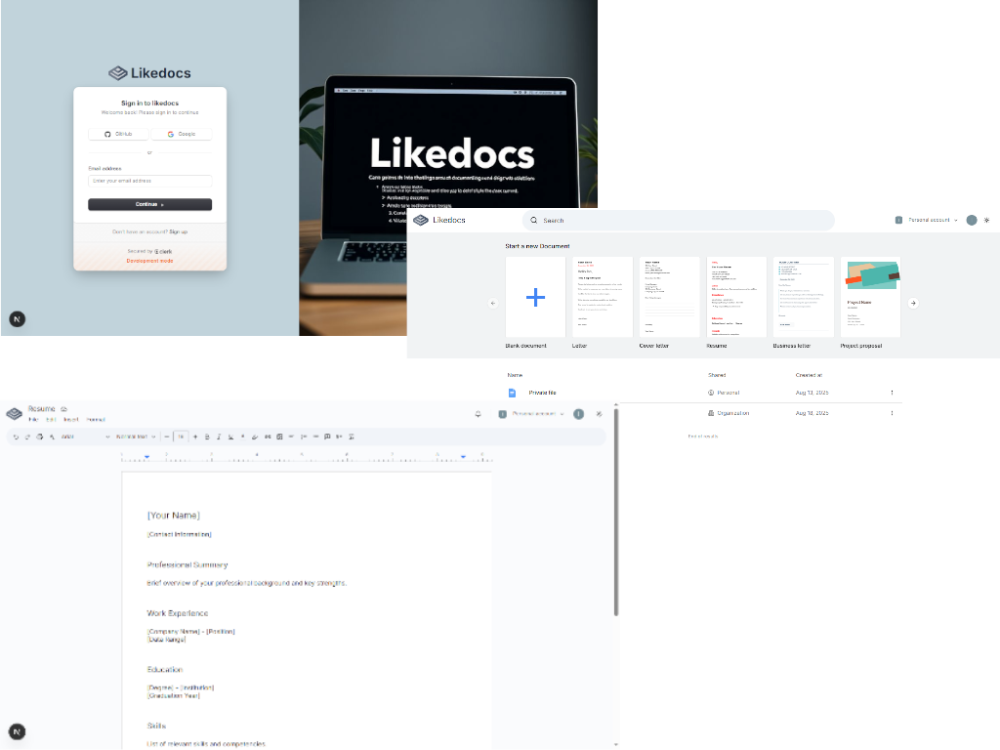

# Likedocs

Likedocs is a web-based document editing and collaboration platform that closely resembles Google Docs. The app allows users to create, edit, and comment on documents in real-time, with a similar look and feel to Google's popular word processing tool.

## Development with:

<!--  -->

- [NextJS](https://nextjs.org/docs)
- [Shadcn-ui](https://ui.shadcn.com/docs)
- [TypeScript](https://www.typescriptlang.org/docs/)
- [Tailwind CSS](https://tailwindcss.com/docs)
- [Clerk](https://clerk.com/docs)
- [Convex](https://docs.convex.dev/home)
- [Liveblocks](https://liveblocks.io/docs/get-started)
- [Tiptap](https://tiptap.dev/docs)

## Functionality:

- mobile-responsive design;
- intuitive, customizable UI using Tailwind CSS and ShadCN components;
- authentication (sign-in / sign-up) with Clerk;
- real-time data (save / fetch) sync using Convex;
- collaborative editing using Liveblocks;
- rich text editing using Tiptap;
- custom document templates;
- swap between light and dark themes;

## Getting Started

### Prerequisites

Before you begin, ensure you have the following installed:

- **Node.js** (>= 16.x)
- **Npm** (or yarn)

1. Clone the repository

```
https://github.com/bakNa2t/likedocs
```

2. Install the dependencies

```
npm install
```

3. Set up the environment variables.
   Create a <code>.env.local</code> file and add your API keys, database credentials, and other necessary environment variables.

```
# Convex's API keys
CONVEX_DEPLOYMENT="YOUR_CONVEX_DEPLOYMENT"
NEXT_PUBLIC_CONVEX_URL="YOUR_NEXT_PUBLIC_CONVEX_URL"

# Clerk's API keys
NEXT_PUBLIC_CLERK_PUBLISHABLE_KEY="NEXT_PUBLIC_CLERK_PUBLISHABLE_KEY"
CLERK_SECRET_KEY="YOUR_CLERK_SECRET_KEY"

# Liveblocks's API keys
LIVEBLOCKS_SECRET_KEY="YOUR_LIVEBLOCKS_SECRET_KEY"
```

4. Run Convex

```
npx convex dev
```

5. Run the development server

```
npm run dev
```

click here to visit => [_**Likedocs**_](https://likedocs.vercel.app/)

<div align="center">
    <p>
        <a href="https://likedocs.vercel.app/" target="_blank" >
            
        </a>
    </p>
</div>

### Acknowledgements by youtube tutorial [Code With Antonio](https://www.youtube.com/watch?v=gq2bbDmSokU)
